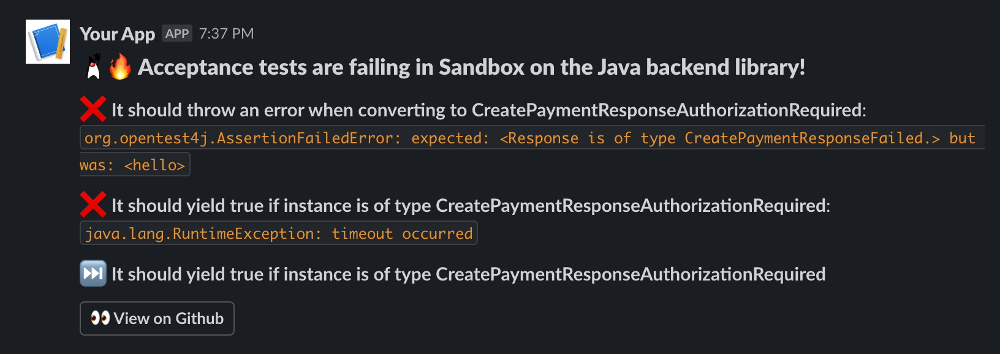

<p align="center">
  
</p>

# Testvox: turns test reports into simple, human readable summaries

Testvox is tiny Rust library with a very simple objective: turning test reports into human readable summaries, to be shared on common messaging apps.
The project simply deals with reports generation, it does not care about *sending* those reports.

At the minute, it only helps turning test results in Junit format into Slack messages, but I'd like add more parsers and reporters in future.

Its primary use case is probably within CI pipelines, although it can be used as CLI and as library as well. 

# Use within CI

Currently, only Github Actions are supported.

## Use as Github action

To use this as Github action it is enough to place the following step after your tests are generated and right before sending the message:
```yaml
  steps:

  # ... Steps that generate test results ...

  - uses: ./ # Uses an action in the root directory
    name: Generate Slack report from Junit results
    id: generate_slack_report
    with:
      include_skipped: true
      reports_pattern: "./test-results/**/*.xml"

  # ... Step that sends the report ...
```

Below, and in the [acceptance-test.yaml](./.github/workflows/acceptance_tests.yml) file you can find a full example: 

```yaml

on: [push]

jobs:
  tests:
    name: Acceptance Tests
    runs-on: ubuntu-latest
    steps:
      - uses: actions/checkout@v4
      - uses: dili91/testvox@v0.1.0
        name: Generate Slack report from Junit results
        id: generate_slack_report
        with:
          include_skipped: true
          reports_pattern: "./test-results/**/*.xml"
      - name: Send Slack report
        uses: slackapi/slack-github-action@v1.26.0
        with:
          payload: ${{steps.generate_slack_report.outputs.report}}
        env:
          SLACK_WEBHOOK_URL: ${{ secrets.SLACK_WEBHOOK_URL }}
          SLACK_WEBHOOK_TYPE: INCOMING_WEBHOOK

```

### Default configuration

The Github action has the following requirements and defaults values: 

| Name            | Required           | Default                                |
|-----------------|--------------------|----------------------------------------|
| title           | :white_check_mark: | `${{ github.repository }} test report` |
| reports_pattern | :white_check_mark: | `./build/test-results/*.xml`           |
| include_skipped | :x:                | false                                  |
| include_passed  | :x:                | false                                  |

# Use as CLI

# Use as library