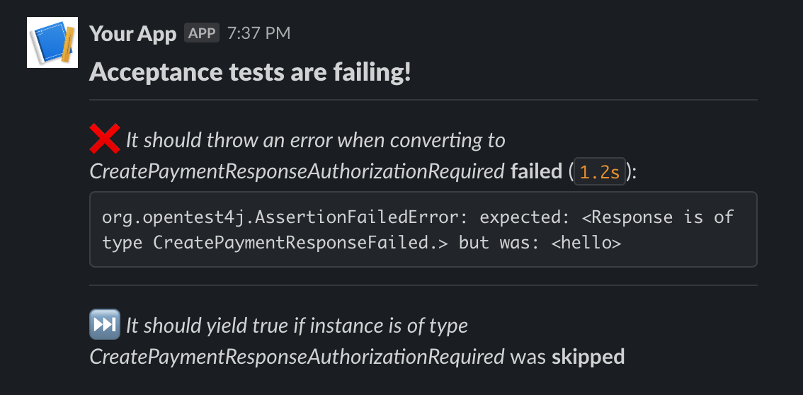

  

# Testvox: turns test reports into simple, human readable summaries

Testvox is tiny Rust library with a very simple objective: turning test reports into messages that and human friendly and ready to be shared. 

At the minute, it only helps turning test results in Junit format into Slack messages, but I'd like add more parsers and reporters in future.

# Use within CI

Currently, only Github Actions are supported.

## Use as Github action

#TODO

# Todo
## `v1.0.0`
  - [ ] Remove code that panics
  - [ ] Add link to test failing on CI
  - [ ] Improve CI build, linting, ecc
  - [ ] improve test coverage
  - [ ] Deterministic ordering: failed, skipped, passed
  - [ ] verify extendibility 
  - [x] Support setting passed and/or failed via flag
  - [ ] Review methods visibility
  - [ ] Test with real project
  - [ ] Review License, contributing (PRs and Issues)

## `Next releases`
  - [ ] Support other test frameworks: js, .net...
  - [ ] Supports defining multiple reports patterns via GH action

